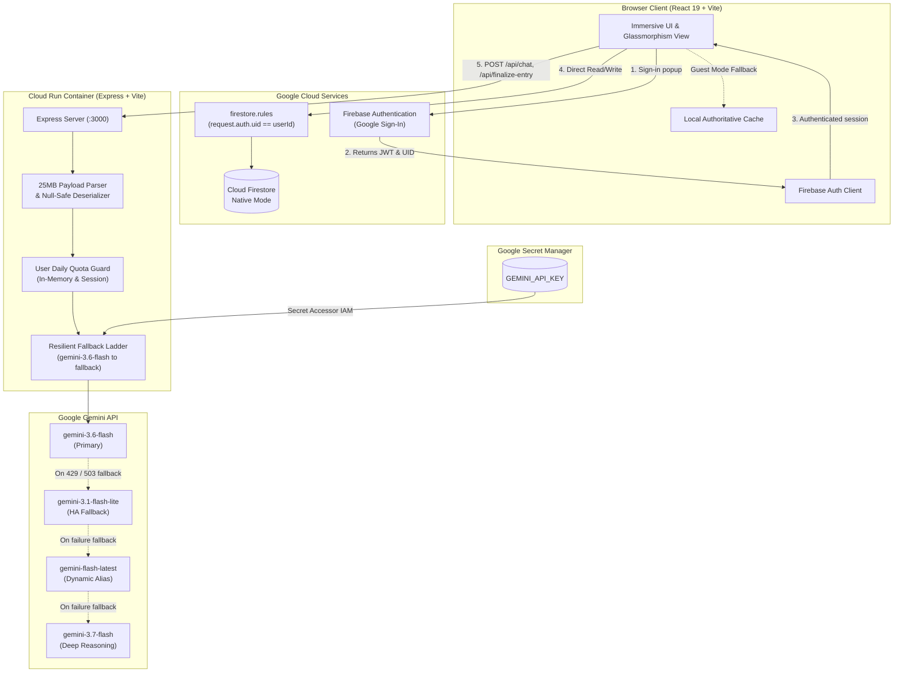
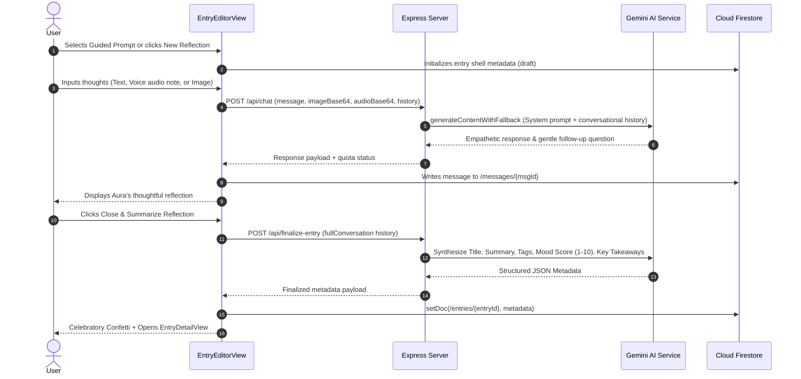
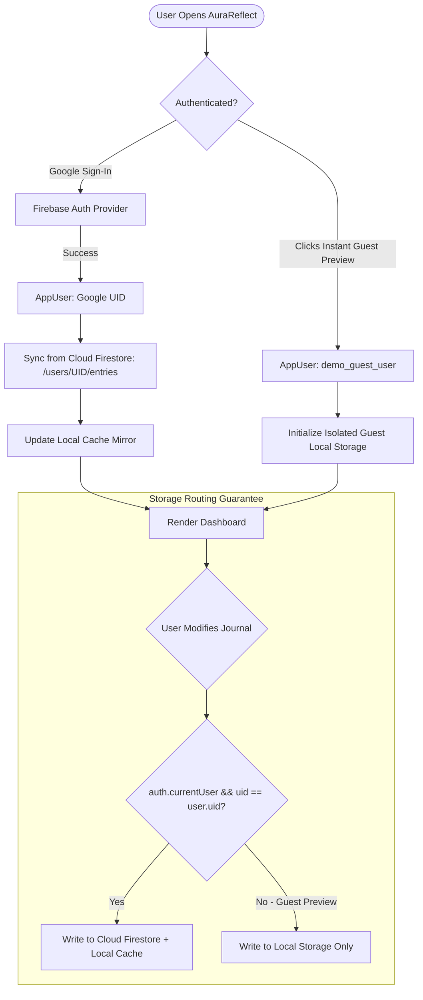
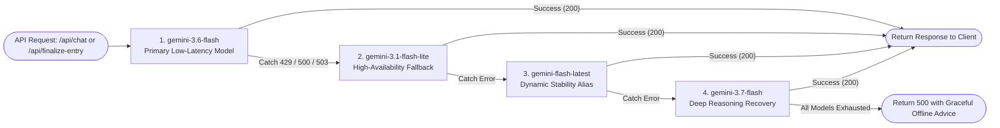

# AuraReflect - AI Journal & Reflection Companion

A secure, user-authenticated reflective journaling web application powered by **Gemini 3.6 Flash** and **Google Cloud Firestore**. 

AuraReflect provides an empathetic, confidential sanctuary for personal introspection, mood tracking, voice notes, and multimodal reflections—protected by strict owner-bound Firestore security rules, server-side API proxying, and Google Cloud Secret Manager.

---

## Table of Contents

1. [Architecture & System Flow Diagrams](#architecture--system-flow-diagrams)
   - [System & Data Architecture](#1-system--data-architecture)
   - [User Reflection Session Lifecycle](#2-user-reflection-session-lifecycle)
   - [Authentication & Dual-Mode State Resolution](#3-authentication--dual-mode-state-resolution)
   - [Resilient Gemini AI Fallback Ladder](#4-resilient-gemini-ai-fallback-ladder)
2. [Complete Local Development & Testing Guide](#complete-local-development--testing-guide)
   - [Prerequisites](#prerequisites)
   - [Step 1: Clone & Install Dependencies](#step-1-clone--install-dependencies)
   - [Step 2: Environment Variables Configuration](#step-2-environment-variables-configuration)
   - [Step 3: Run the Local Development Server](#step-3-run-the-local-development-server)
   - [Step 4: Step-by-Step Local Testing Walkthrough](#step-4-step-by-step-local-testing-walkthrough)
   - [Step 5: Code Quality & Production Build Verification](#step-5-code-quality--production-build-verification)
3. [Repository & Project Structure Guide](#repository--project-structure-guide)
   - [Directory Tree](#directory-tree)
   - [Core Frontend Modules](#core-frontend-modules)
   - [Backend Architecture (`server.ts`)](#backend-architecture-serverts)
   - [Cloud Firestore Data Model](#cloud-firestore-data-model)
   - [REST API Endpoints Reference](#rest-api-endpoints-reference)
4. [Agentic Threat Model & Security Posture](#agentic-threat-model--security-posture)
5. [Google Cloud Run Production Deployment](#google-cloud-run-production-deployment)
   - [Secret Management Setup](#secret-management-setup)
   - [Firestore Rules Deployment](#firestore-rules-deployment)
   - [Cloud Run Deployment Command](#cloud-run-deployment-command)
   - [Mandatory Campaign Verification Labeling](#mandatory-campaign-verification-labeling)

---

## Architecture & System Flow Diagrams

### 1. System & Data Architecture



### 2. User Reflection Session Lifecycle



### 3. Authentication & Dual-Mode State Resolution



### 4. Resilient Gemini AI Fallback Ladder



---

## Complete Local Development & Testing Guide

### Prerequisites

Ensure the following tools are installed on your workstation:
- **Node.js**: v18.0.0 or higher (v20+ recommended)
- **npm**: v9.0.0 or higher
- **Git**: Installed and configured
- **Gemini API Key**: From [Google AI Studio](https://aistudio.google.com/)

---

### Step 1: Clone & Install Dependencies

```bash
# 1. Clone your repository
git clone <YOUR_REPOSITORY_URL>
cd <YOUR_REPOSITORY_DIRECTORY>

# 2. Install dependencies
npm install
```

---

### Step 2: Environment Variables Configuration

1. Create your local `.env` file from `.env.example`:
   ```bash
   cp .env.example .env
   ```

2. Open `.env` and configure your API keys:
   ```env
   # Required: Your Gemini API Key from Google AI Studio
   GEMINI_API_KEY=AIzaSyYourGeminiApiKeyHere

   # Optional: Custom Port (Defaults to 3000 if omitted)
   PORT=3000
   ```

3. **Firebase Configuration Note**:
   - For **Instant Guest Preview**, zero configuration is required—the app runs out-of-the-box using local storage persistence.
   - For **Cloud Firestore & Google Sign-In**, ensure `firebase-applet-config.json` is present or update `src/lib/firebase.ts` with your Firebase project credentials.

---

### Step 3: Run the Local Development Server

Run the unified full-stack development server powered by `tsx` and Vite:

```bash
npm run dev
```

The terminal will confirm:
```text
Server running on http://localhost:3000
```

Open your browser at [http://localhost:3000](http://localhost:3000).

---

### Step 4: Step-by-Step Local Testing Walkthrough

#### Test 1: Health & API Verification
Open a separate terminal window or browser tab to verify backend readiness:
```bash
curl http://localhost:3000/api/health
```
**Expected Response:**
```json
{"status":"ok","hasGeminiKey":true,"timestamp":"2026-09-05T..."}
```

#### Test 2: Instant Guest Preview (Zero-Config Testing)
1. On the landing page, click **"Explore Instant Guest Preview"**.
2. Verify you are immediately redirected to the authenticated dashboard without login friction.
3. Confirm the pre-populated sample reflection entries appear and user avatar displays *"Mindful Explorer"*.

#### Test 3: Google Federated Authentication
1. Click the top-right profile avatar $\rightarrow$ click **"Sign Out"**.
2. On the landing page, click **"Continue with Google"**.
3. Complete the Google Auth popup.
4. Verify you land on your personal dashboard displaying your Google profile name and photo.

#### Test 4: Guided Prompt Selection & Active Reflection
1. On the dashboard, review the starter prompts (e.g., *"Daily Energy Audit"*, *"The Unprocessed Feeling"*).
2. Click **"The Unprocessed Feeling"** card.
3. Confirm the conversation editor loads with Aura's welcome message acknowledging the theme.
4. Type: *"I felt anxious about a presentation today, but once I started talking, the fear dissipated."*
5. Click **"Send"** (or press Enter).
6. Verify Aura responds empathetically with psychological insight and a gentle follow-up question.

#### Test 5: Voice Recording & Photo Attachments
1. Click the **Microphone** icon. If prompted by your browser, click **Allow**. Speak a 5-second reflection and click the stop checkmark.
2. Click the **Image Attachment** paperclip icon and select any `.jpg` or `.png` photo.
3. Verify the image thumbnail preview renders cleanly with a remove button.
4. Press **"Send"** and verify Gemini incorporates both your speech and visual context into its response.

#### Test 6: Finalize Entry & Auto-Synthesis
1. In an active conversation, click **"Close & Summarize Reflection"** in the top header.
2. Watch the synthesis loader trigger.
3. Verify that within 2–3 seconds:
   - Celebration confetti bursts on the screen.
   - Aura produces an evocative 3–6 word title (e.g., *"Transforming Presentation Anxiety into Confidence"*).
   - Mood score (1–10) and mood label (e.g., *"Uplifted"*, *"Grounded"*) are assigned.
   - Key takeaways are listed as clean bullet points.
4. Verify the entry is saved to Firestore and navigates to the Entry Detail view.

#### Test 7: Emotional Resonance Mood Chart
1. Return to the main dashboard.
2. Verify the **"Emotional Resonance Arc"** SVG chart updates with your new mood score data point.
3. Hover over the nodes to see tooltips displaying the reflection title, date, and mood rating.

#### Test 8: AI Mindset & Growth Recap
1. In the navigation bar, click **"AI Recap"**.
2. Select **"Weekly Arc"** or **"Monthly Retrospective"**.
3. Click **"Generate Synthesis"**.
4. Verify Gemini reads your past reflections and produces:
   - Mindset Headline
   - Emotional Arc Narrative
   - Dominant Themes (e.g., *Resilience*, *Self-Compassion*)
   - Celebrated Personal Wins
   - Mindful Next Steps

#### Test 9: Data Portability (Markdown & PDF Export)
1. On the dashboard, click **"Export"** in the navigation header.
2. Click **"Download Full History (.md)"**. Verify a formatted markdown file downloads containing your complete reflection journal.
3. Click **"Print or Save to PDF"**. Verify your browser's native print preview dialog opens with a dedicated print layout.

#### Test 10: GDPR Cascade Deletion
1. Click the profile avatar $\rightarrow$ select **"Delete Account & Vault"**.
2. In the modal dialog, type `DELETE` into the confirmation field.
3. Click **"Destroy Account & Data"**.
4. Confirm all data in Firestore and local storage is obliterated, and you are securely redirected to the public landing page.

---

### Step 5: Code Quality & Production Build Verification

Verify that your codebase is free of TypeScript compilation errors and builds into a production bundle:

```bash
# 1. Run TypeScript typecheck & lint
npm run lint

# 2. Compile frontend assets (Vite) and backend bundle (esbuild)
npm run build

# 3. Test the compiled production server locally
npm start
```

---

## Repository & Project Structure Guide

### Directory Tree

```text
├── firestore.rules               # Cloud Firestore security rules (owner-bound isolation)
├── firebase-blueprint.json       # Structural Firestore entity schemas and permissions
├── firebase-applet-config.json   # Public Firebase Web Client credentials (gitignored)
├── package.json                  # Dependencies, dev/build scripts, and runtime configuration
├── tsconfig.json                 # TypeScript compiler configuration
├── vite.config.ts                # Vite frontend bundler configuration with Tailwind CSS plugin
├── metadata.json                 # Google AI Studio app configuration and capabilities
├── .env.example                  # Environment variables template
├── .gitignore                    # Git ignore rules (node_modules, dist, secrets, config)
├── server.ts                     # Full-stack entrypoint: Express API routes + Vite middleware
│
├── public/                       # Static public assets
│   ├── favicon.ico
│   └── og-image.png
│
├── src/                          # Frontend React 19 application
│   ├── main.tsx                  # Client entrypoint mounting Root React component
│   ├── App.tsx                   # Central view state router, authentication & modals manager
│   ├── index.css                 # Tailwind CSS v4 root stylesheet & typography configurations
│   ├── types.ts                  # Shared TypeScript interfaces (AppUser, JournalEntry, etc.)
│   │
│   ├── components/               # Modular UI Components
│   │   ├── Navbar.tsx            # Sticky header with user avatar, streak badge, and modals
│   │   ├── LandingView.tsx       # Welcoming landing page with Google & Guest preview buttons
│   │   ├── DashboardView.tsx     # Main dashboard: mood graph, prompt cards, entries list
│   │   ├── EntryEditorView.tsx   # Active reflection session: chat stream, audio/photo input
│   │   ├── EntryDetailView.tsx   # Read-only entry view with key takeaways & markdown copy
│   │   ├── MoodChart.tsx         # Interactive SVG cubic-bezier mood trajectory graph
│   │   ├── AiRecapModal.tsx      # Modal generating weekly/monthly retrospective syntheses
│   │   ├── ExportModal.tsx       # Modal for downloading .md archives or triggering PDF print
│   │   └── DeleteAccountModal.tsx# GDPR compliance modal for cascade account obliteration
│   │
│   └── lib/                      # Business Logic, Utilities, and Services
│       ├── firebase.ts           # Firebase SDK initialization & connection testing
│       ├── firestoreService.ts   # Firestore CRUD, streak calculations, error handling
│       └── promptsData.ts        # Curated mindfulness, anxiety, and gratitude prompt seeds
```

---

### Core Frontend Modules

| Module / Component | Primary Responsibility |
| :--- | :--- |
| **`src/App.tsx`** | Central orchestrator. Manages Firebase Auth observer, view switching (`dashboard` $\leftrightarrow$ `editor` $\leftrightarrow$ `detail`), entry states, and modal dialogs. |
| **`src/components/EntryEditorView.tsx`** | Handles multi-turn conversational interaction with Aura. Integrates MediaRecorder for voice reflections, canvas image compression, and synthesis triggers. |
| **`src/components/DashboardView.tsx`** | Displays user stats (streak, total reflections, average mood score), guided prompt starter chips, search/filter controls, and the `MoodChart`. |
| **`src/components/MoodChart.tsx`** | Custom SVG data visualizer rendering an interpolated cubic Bézier curve of emotional sentiment over time with interactive tooltips. |
| **`src/lib/firestoreService.ts`** | Dual-mode persistence layer. Persists authenticated users to Cloud Firestore `/users/{uid}/entries` and handles offline/guest fallback to `localStorage`. Strips `undefined` values to prevent driver crashes. |

---

### Backend Architecture (`server.ts`)

The Express server handles all Gemini API communication server-side so secret keys are never exposed to the client:

1. **Payload Hygiene**: Top-level `express.json({ limit: "25mb" })` parser with null-safe request body destructuring.
2. **Lazy GenAI Initialization**: Evaluates `process.env.GEMINI_API_KEY` upon first request to prevent cold-start crashes if secrets are mounting.
3. **Resilient Fallback Ladder**: Iterates through `gemini-3.6-flash` $\rightarrow$ `gemini-3.1-flash-lite` $\rightarrow$ `gemini-flash-latest` $\rightarrow$ `gemini-3.7-flash` when catching recoverable HTTP 429/500/503 status codes.
4. **Vite Development Middleware**: Automatically attaches Vite middleware in development mode for instantaneous HMR, while serving static pre-bundled assets from `dist/` in production.

---

### Cloud Firestore Data Model

The database uses an owner-isolated hierarchical document path:

#### 1. Entry Document Path: `/users/{userId}/entries/{entryId}`
```json
{
  "id": "entry_1725542400000",
  "userId": "firebase_auth_uid",
  "title": "Navigating Anxiety & Finding Grounding",
  "summary": "Explored feelings of tension regarding work milestones and uncovered calm through breathwork.",
  "tags": ["Mindfulness", "Anxiety", "Self-Care"],
  "moodScore": 8,
  "moodLabel": "Grounded",
  "keyTakeaways": [
    "Acknowledging feelings dissipates their intensity.",
    "A 5-minute pause restores cognitive clarity."
  ],
  "createdAt": "2026-09-05T12:00:00.000Z",
  "updatedAt": "2026-09-05T12:15:00.000Z",
  "isClosed": true,
  "messagesCount": 4,
  "guidedPromptTitle": "The Unprocessed Feeling"
}
```

#### 2. Message Document Path: `/users/{userId}/entries/{entryId}/messages/{messageId}`
```json
{
  "id": "msg_1725542410000",
  "role": "user",
  "content": "I noticed I was holding tension in my shoulders all afternoon.",
  "timestamp": "2026-09-05T12:01:00.000Z",
  "imageBase64": null,
  "imageMimeType": null,
  "hasAudio": false,
  "audioDurationSeconds": 0
}
```

---

### REST API Endpoints Reference

#### 1. `GET /api/health`
- **Description**: Returns backend health and Gemini API key status.
- **Response**: `{"status": "ok", "hasGeminiKey": true, "timestamp": "..."}`

#### 2. `POST /api/chat`
- **Description**: Processes a conversational turn with Gemini 3.6 Flash.
- **Request Body**:
  ```json
  {
    "uid": "user_uid_or_guest",
    "userMessage": "My journal thought...",
    "history": [{"role": "user", "content": "..."}, {"role": "model", "content": "..."}],
    "imageBase64": "optional_data_url",
    "audioBase64": "optional_data_url",
    "guidedPromptTitle": "Optional Prompt Title"
  }
  ```
- **Response**: `{"reply": "Aura's empathetic response...", "modelUsed": "gemini-3.6-flash", "quotaRemaining": 59}`

#### 3. `POST /api/finalize-entry`
- **Description**: Generates structured metadata, sentiment rating, and key takeaways for an entry.
- **Request Body**: `{"fullConversation": [{"role": "user", "content": "..."}, ...]}`
- **Response**:
  ```json
  {
    "title": "Evocative Title",
    "summary": "2-3 sentence summary...",
    "tags": ["Mindfulness", "Growth"],
    "moodScore": 8,
    "moodLabel": "Peaceful",
    "keyTakeaways": ["Insight 1", "Insight 2"]
  }
  ```

#### 4. `POST /api/generate-recap`
- **Description**: Analyzes historical entries to generate a comprehensive emotional retrospective.
- **Request Body**: `{"entries": [...], "timeframe": "weekly" | "monthly"}`
- **Response**:
  ```json
  {
    "headline": "A Week of Gentle Grounding",
    "summary": "Narrative arc of your emotional evolution...",
    "dominantThemes": ["Resilience", "Mindful Pauses"],
    "winsCelebrated": ["Acknowledging stress without judgment"],
    "growthAreas": ["Prioritizing evening decompression"],
    "mindfulPractice": "Try a 3-breath pause before meetings."
  }
  ```

---

## Agentic Threat Model & Security Posture

| Threat Zone | Identified Attack Vector / Scenario | Implemented Countermeasure |
| :--- | :--- | :--- |
| **Input Surfaces** | Malformed payloads, oversized file uploads, prompt injection via reflections. | Top-level deserialization, defensive payload ingestion (`null-safe` destructuring), 25MB limits, input validation. |
| **Planning & Reasoning** | Prompt injection attempting to leak system instructions or break persona. | System prompt boundary separating user reflections from execution instructions; treats untrusted input as passive text. |
| **Tool Execution** | Gemini API key extraction or client-side exposure. | Server-only initialization via Secret Manager / `process.env.GEMINI_API_KEY`; no client exposure. |
| **Memory & State** | Cross-user data leakage, reading other users' private journal reflections. | Hardened `firestore.rules` checking `request.auth.uid == userId`; strict zero-crash undefined-stripping. |
| **Inter-System Comm** | Session hijacking, unauthenticated API abuse, or runaway spending. | Per-user daily reflection quota counter, token validation, and graceful fallback handling. |

---

## Google Cloud Run Production Deployment

### Secret Management Setup

Store your Gemini API key securely in Google Cloud Secret Manager and grant Cloud Run permissions to read it:

```bash
# 1. Create and populate the secret
gcloud secrets create GEMINI_API_KEY --replication-policy="automatic"
echo -n "YOUR_GEMINI_API_KEY" | gcloud secrets versions add GEMINI_API_KEY --data-file=-

# 2. Grant the default Compute Engine service account access
PROJECT_NUMBER=$(gcloud projects describe $(gcloud config get-value project) --format="value(projectNumber)")

gcloud secrets add-iam-policy-binding GEMINI_API_KEY \
  --member="serviceAccount:${PROJECT_NUMBER}-compute@developer.gserviceaccount.com" \
  --role="roles/secretmanager.secretAccessor"
```

---

### Firestore Rules Deployment

Deploy the hardened, owner-bound security rules to your Firebase Firestore project:

```javascript
rules_version = '2';
service cloud.firestore {
  match /databases/{database}/documents {
    // User data isolation: each user can only read and write their own documents
    match /users/{userId} {
      allow read, write: if request.auth != null && request.auth.uid == userId;
      
      match /entries/{entryId} {
        allow read, write: if request.auth != null && request.auth.uid == userId;
        
        match /messages/{messageId} {
          allow read, write: if request.auth != null && request.auth.uid == userId;
        }
      }

      match /{allSubcollections=**} {
        allow read, write: if request.auth != null && request.auth.uid == userId;
      }
    }
  }
}
```

Deploy the rules via Firebase CLI:
```bash
firebase deploy --only firestore:rules
```

---

### Cloud Run Deployment Command

Build and deploy the application container to Google Cloud Run:

```bash
# Deploy to Google Cloud Run
gcloud run deploy aurareflect-app \
  --source . \
  --region us-central1 \
  --platform managed \
  --allow-unauthenticated \
  --set-secrets="GEMINI_API_KEY=GEMINI_API_KEY:latest" \
  --port 3000
```

---

### Mandatory Campaign Verification Labeling

Apply the mandatory challenge label to register your Cloud Run service for verification:

```bash
gcloud run services update aurareflect-app \
  --update-labels=dev-tutorial=cloud-run-ai-challenge \
  --region=us-central1
```

